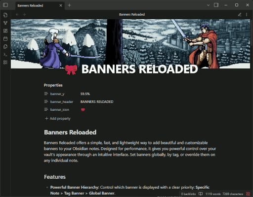

# Banners Reloaded

Banners Reloaded offers a simple, fast, and lightweight way to add beautiful and customizable banners to your Obsidian notes. Designed for performance, it gives you powerful control over your vault's appearance through an intuitive interface. Set banners globally, by tag, or override them on any individual note.



## Table of Contents

- [Features](#features)
- [Installation](#installation)
  - [From the Obsidian Community Plugin Store (Recommended)](#from-the-obsidian-community-plugin-store-recommended)
  - [Using BRAT (for pre-releases and testing)](#using-brat-for-pre-releases-and-testing)
- [Configuration Guide](#configuration-guide)
  - [Banner Management](#banner-management)
  - [Note Properties](#note-properties)
  - [Banner Header](#banner-header)
  - [Additional Contexts](#additional-contexts)
  - [Banners by Tag](#banners-by-tag)
  - [Maintenance](#maintenance)
- [Per-Note Usage (Frontmatter Overrides)](#per-note-usage-frontmatter-overrides)
  - [Available Frontmatter Properties](#available-frontmatter-properties)
- [Contributing](#contributing)
  - [Reporting Bugs](#reporting-bugs)
  - [Suggesting Enhancements](#suggesting-enhancements)
  - [Submitting Code Changes (Pull Requests)](#submitting-code-changes-pull-requests)
  - [Contributing Translations](#contributing-translations)
- [A Note on the Original Banners Plugin](#a-note-on-the-original-banners-plugin)

## Features

- **Powerful Banner Hierarchy:** Control which banner is displayed with a clear priority: **Specific Note > Tag Banner > Global Banner**.
- **Interactive Vertical Alignment:** Vertically drag any banner to focus on the perfect part of the image. The position is automatically saved to the note's frontmatter.
- **Overlay Headers:** Add titles and icons over your banners, with full control over their vertical and horizontal alignment, decoration, and size.
- **Powerful Header Templating:** Dynamically display content in your headers. Use {{filename}} for the note's name, or insert any frontmatter property like {{status}} or {{author}}. It even resolves nested variables (e.g., if your frontmatter has title: "Project {{project_name}}").
- **Tag-Based Rules:** Associate banner images with specific tags. It even supports nested tags (`#family/project`)! Rules at the top of the settings list have higher priority.
- **Adaptive Design:** Set different banner heights for desktop, mobile, and embed/popover contexts.
- **Full Context Support:** Banners work in the main note view, in note **embeds**, and in link preview **popovers**.
- **Intuitive Settings:**
    - Select images from your vault with a file selector that includes image previews.
    - Define a banner folder to narrow down searches.
    - Enjoy folder autocompletion in the settings.
    - Reorder the priority of tag banners with drag-and-drop.
- **Migration Tool:** Includes a tool to easily standardize your vault by converting banner paths from plain strings or embeds to the standard Wikilink format `[[image.png]]`.

## Installation

### From the Obsidian Community Plugin Store (Recommended)

Once the plugin is approved, you will be able to install it directly from the Obsidian Community Plugin Store.

1. Go to `Settings` > `Community Plugins`.
2. Make sure "Safe Mode" is turned **off**.
3. Click `Browse` to open the community plugin store.
4. Search for "**Banners Reloaded**".
5. Click `Install`.
6. Once installed, click `Enable`.

### Using BRAT (for pre-releases and testing)

For those who want the latest features and updates before they are officially released:

1. Install the [BRAT](https://github.com/TfTHacker/obsidian42-brat) plugin.
2. Go to `Settings` > `BRAT` > `Add Beta plugin` and enter the URL `https://github.com/dgcreations00/obsidian-banners-reloaded`.
3. Enable the plugin in `Settings` > `Community Plugins`.

## Configuration Guide

Access the settings via `Settings > Community Plugins > Banners Reloaded`.

### Banner Management

- **Banners folder:** Define a default folder to search for images (e.g., `Resources/Banners`). If left empty, the entire vault will be searched. The image selector will use this folder.
- **Enable default banners:** If enabled, notes that don't have a banner in their frontmatter (or a tag matching a rule) will display the global default banner.
- **Default banner image:** The image to be used as a global fallback.

### Note Properties

- **Frontmatter Property:** The name of the main YAML property. The default is `banner`. All other override properties will use this name as a prefix (e.g., `banner_y`, `banner_height`).
- **Default banner height:** The CSS height for banners in the main desktop view (e.g., `200px`, `30vh`).
- **Default mobile banner height:** The height for the main view on mobile devices.

### Banner Header

- **Show default title/icon:** Separate toggles to control whether the default text or icon is displayed on notes that do not explicitly define them.
- **Vertical/Horizontal Alignment:** Defines the default position of the header on the banner (`Top`, `Center`, `Bottom` and `Left`, `Center`, `Right`).
- **Header decoration:** Adds a visual effect (shadow or border) to improve legibility.
- **Title font size:** The default CSS font size for the header text.
- **Icon size:** The default CSS size for the header icon/emoji.
- **Default icon:** An Obsidian icon ID (e.g., `lucide-book`) or an emoji.
- **Default header text:** A template for the text that appears on the banner. You can use {{filename}} to insert the note's name, or {{your_property}} to use any value from the note's frontmatter. Nested variables are also supported.

### Additional Contexts

- **Show banners in embeds/popovers:** Toggles to enable or disable banners in these contexts.
- **Banner height in embeds and popovers:** A specific height for these contexts, where space is often more limited.

### Banners by Tag

This section allows you to create rules to assign banners to notes containing certain tags.

- **Add new tag rule:** Creates a new row.
- **Drag and Drop:** Use the handle on the left to change the order of the rules. **Priority is from top to bottom**: the first rule that matches a tag in the note (or one of its nested parts) will be applied.
- **Tag:** The name of the tag without the `#`.
- **Select banner:** Opens a selector to choose the image associated with that tag.

### Maintenance

- **Banner conversion tool:** Opens a modal that will search your entire vault and convert banner properties to the standard Wikilink format `[[path/to/image.png]]`. This is useful for standardizing your vault or migrating from plugins that used plain strings or embeds.

## Per-Note Usage (Frontmatter Overrides)

You can override almost any global setting directly in a note's YAML frontmatter. Use the `Frontmatter Property` name you defined in the settings as a prefix.

**Simple Example:**
Using wikilinks (recommended)
```yaml
---
banner: "[[Banners/my-local-banner.png]]"
---
```

Using file path as string
```yaml
---
banner: "Banners/my-local-banner.png"
---
```

Using remote images
```yaml
---
banner: "https://images.unsplash.com/photo-1506744038136-46273834b3fb"
---
```

**Disable a Banner in a Note:**
(Even if it has a banner tag or a global banner is active)
```yaml
---
banner: none
---
```

**Disable only the Header in a Note:**
(If a global header or icon is active)
```yaml
---
banner: "[[Banners/my-local-banner.png]]"
banner_header: false
banner_icon: false
---
```

**Full Example (assuming the prefix is `banner`):**
```yaml
---
# Priority 1: Specific banner for this note (can be local or remote)
banner: "[[Banners/my-local-banner.png]]"

# Custom frontmatter data for the template
status: "In Progress"
project_name: "Obsidian Plugin"
title: "Notes on {{project_name}}" # Nested variable!

# Height override (ignores default values)
banner_height: "300px"
banner_mobile_height: "150px"

# Vertical position override (dragging the image updates this)
banner_y: "75%"

# Header override using a template
banner_icon: "lucide-star"
banner_header: "{{title}} - Status: {{status}}"

# Header alignment, style, and SIZE override
banner_header_v: "center"
banner_header_h: "center"
banner_header_decor: "border"
banner_header_title_size: "2.5em"
banner_header_icon_size: "3em"
---
```

### Available Frontmatter Properties

Below are all the properties you can use, assuming the prefix in the settings is `banner`.

- `banner`: The path to the banner image.
    - Accepts local paths (Wikilinks): `"[[Banners/my_image.png]]"`
    - Accepts local paths (Strings): `"Banners/my_image.png"`
    - Accepts external URLs: `"https://example.com/image.jpg"`
    - To **disable** a banner, use: `banner: false` or `banner: none`.
- `banner_height`: CSS height for the banner in this note (applies to desktop, embeds, and popovers).
- `banner_mobile_height`: Specific CSS height for this note on mobile.
- `banner_y`: The vertical position of the image (from `0%` to `100%`). This is updated when you drag the image.
- `banner_header`: The text to display in the header. Supports templates: use {{filename}} for the note's name or {{any_frontmatter_key}} to insert metadata. Nested variables are resolved. To disable, use: `banner_header: false` or `banner_header: none`.
- `banner_icon`: An emoji or Obsidian icon ID to display. To **disable**, use: `banner_icon: false` or `banner_icon: none`.
- `banner_header_v`: Vertical alignment of the header. Values: `top`, `center`, `bottom`, `edge`.
- `banner_header_h`: Horizontal alignment. Values: `left`, `center`, `right`.
- `banner_header_decor`: Text decoration. Values: `none`, `shadow`, `border`.
- `banner_header_title_size`: CSS size for the title font (e.g., `"2em"`, `"25px"`).
- `banner_header_icon_size`: CSS size for the icon/emoji (e.g., `"2.5em"`, `"30px"`).

## Contributing

Contributions of any kind are welcome and greatly appreciated! If you're interested in helping improve Banners Reloaded, here are a few ways you can get involved.

### Reporting Bugs

If you encounter a bug or unexpected behavior, please open an issue on GitHub. A great bug report includes:

- A clear and descriptive title.
- Detailed, step-by-step instructions on how to reproduce the issue.
- What you expected to happen versus what actually happened.
- Screenshots or GIFs are incredibly helpful!
- Information about your environment (Obsidian version, plugin version, OS, etc.).

Before creating a new issue, please check if a similar one already exists.

### Suggesting Enhancements

Have an idea for a new feature or an improvement to an existing one? Feel free to open an issue to start a discussion. The more detail you can provide about your use case and the problem you're trying to solve, the better.

### Submitting Code Changes (Pull Requests)

Code contributions are always welcome, from small bug fixes to new features. To contribute:

1. Fork the repository.
2. Create a new branch for your changes (e.g., `feat/add-new-alignment-option` or `fix/popover-rendering-bug`).
3. Make your changes to the code.
4. Ensure your code is clean and follows the existing style.
5. Submit a Pull Request with a clear description of what you've changed and why.

### Contributing Translations

If you'd like to translate the plugin into your language, it's easy!

1. In the `src/l10n/` folder, copy the `en.json` file.
2. Rename your copy to your language's two-letter ISO 639-1 code (e.g., `fr.json` for French, `de.json` for German).
3. Translate all the string **values** in your new file, but be careful not to change the **keys**.
4. Open the `src/i18n.ts` file and add your new language:
    - Add the import: `import fr from './l10n/fr.json';`
    - Add it to the `locales` object: `const locales = { en, es, fr };`
5. Submit a Pull Request with your changes.

Thank you for helping to make Banners Reloaded better!

## A Note on the Original Banners Plugin

This plugin is a spiritual successor to the original [Banners plugin](https://github.com/noatpad/obsidian-banners) created by [noatpad](https://github.com/noatpad/).

While heavily inspired by the original's great concept and features, **Banners Reloaded has been written entirely from scratch**. The goal was to provide a modern, fast, and lightweight alternative built with the latest technologies, including Svelte 5. This new codebase ensures better performance, stability, and easier maintenance for future updates.

A big thank you to [noatpad](https://github.com/noatpad/) for the original idea that inspired this project.